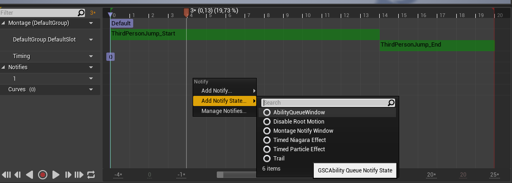
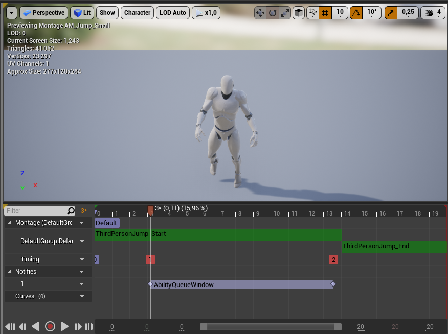
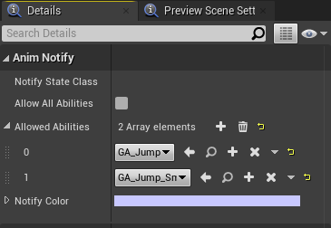
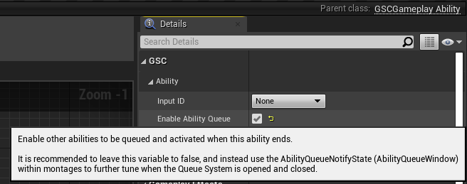

GAS Companion comes with an Ability Queueing System that allows your characters to buffer up an ability for activation.

## Why using an Ability Queue System

Imagine using a potion to gain some health, and an enemy is about to attack you so you're spamming the dodge button to not get harmed. Depending on how you designed your abilities, your healing ability (here using a potion) might block other abilities such as dodge preventing the activation until the first ability is ended. Usually nothing happens, and the gameplay feels unresponsive.

With Ability Queueing, the dodge ability in this example would trigger immediately after the potion ability, even if the input was pressed during the first ability.

This is a feature commonly implemented in a lot of games, such as Action RPG games like Souls-like game. You can see how it was implemented for Mortal Shell in this [Behind the Scenes of Mortal Shell | Inside Unreal](https://www.youtube.com/watch?v=8yLq7jlVCAY&t=6090s&ab_channel=UnrealEngine) stream.

The Ability Queue System of GAS Companion is inspired by their Input Queue System, and adapted to work with the Gameplay Ability System. The main difference about the two systems is that we don't really queue the input, but rather the Gameplay Abilities in the perspective of GAS.

## High Level Concepts

How it's done internally is rather simple. This works mainly by listening for ability failure and completion.

We listen for any failed ability (usually because another ability is currently running and blocking other abilities via Blocking Tags) and store a reference to it. When any ability ends, we check if we have a queued ability and, if so, try to activate it again.

**Note** *Only one ability is queued. When multiples abilities are triggered when the Ability Queue is opened, only the last one is considered for activation.*

## Enable Ability Queue

The bulk of setting up the Ability Queue revolves around using an Animation Notify State `AbilityQueueWindow` in your Animation Montages, or turn on the `Enable Ability Queue` property in your abilities. If the ability uses Animation Montages, it is recommended to use the Anim Notify State method as it provides more control on when and how the ability is queued.

## Adding the Ability Queue Component

First, you need to ensure your Pawn / Characters have `GSCAbilityQueue` actor component. This component is required for the Ability Queue System to work properly.

`GSCAbilityQueue` is not added to the Modular Actors classes by default, which means that this is something you need to do manually in your Blueprints. 

To do so, simply click the `Add Component` button in the components view, and search for `GSCAbilityQueue`

### with Anim Notify State

This is the recommended method when your abilities are using Anim Montages.

Open the Anim Montage that is played by your ability, and add an `AbilityQueueWindow` Notify State in one of the Notifies Tracks.

Make it start / end when you want to open and close the ability queue, by dragging the little slider on the notify state at the exact desired frames.

Abilities will be queued only within this notify state window.

`AbilityQueueWindow` has two configurable properties to specify which abilities are allowed to be queued. If you click on the the notify state, it should update the Details Panel with:

- `Allow All Abilities` if enabled, every abilities will be considered for the ability queue.
- `Allowed Abilities` is a list of Gameplay Abilities (Subclass of `GSCGameplayAbility`) that are allowed to be queued. if `AllowAllAbilities` is enabled, this list has no effect.

Don't forget to configure one of the above properties.

**Note** *If you ever have the issue of the notify state being called twice, make sure to change the Montage Tick Type to Branching Points ([see this forum post](https://forums.unrealengine.com/t/queued-anim-notify-state-triggers-twice-bug-or-am-i-misunderstanding-it/142233)). Although, the queue system won't be affected, you might just see the Anim Montages registered twice with the [Debug Widget](#debug-widget).*

### with Enable Ability Queue property on Abilities

If your ability doesn't use an Anim Montage, this is where the `bEnableAbilityQueue` property on Abilities (`GSCGameplayAbility`) comes in handy, or if you want to quickly turn on queueing on your abilities.

In the Ability Details Panel, turn on `Enable Ability Queue` property:

When turned on, it will essentially open the ability queue at the beginning of activation and close it when the ability ends, with all abilities allowed.

## Debug Widget

You can show / hide the Ability Queue Debug Widget with the `GASCompanion.Debug.AbilityQueue` command

Hit `²` while the game is running to open the Console Command (more info in the [Console Commands]({{ "/console-commands" | url }}) page), and type `GASCompanion.Debug.AbilityQueue`. It will display the debug widget from where you can see the state of the Ability Queue (enabled, opened, allowed abilities, currently queued ability and montages)

https://youtu.be/NCSlxAgYnOI

From Blueprints, If you need to to show the debug widget, this would look like this:

