Custom attributes, either created manually or generated through the [Attributes Wizard]({{ "/attributes/attributes-wizard/" | url }}), may need to implement some attributes management.

To that end, `GSC Core Component`, exposes Blueprint Assignable Events for [`PreAttributeChange`](https://github.com/tranek/GASDocumentation#concepts-as-preattributechange) and [`PostGamepayEffectExecute`](https://github.com/tranek/GASDocumentation#concepts-as-postgameplayeffectexecute) that lets you handle attribute changes from Blueprints, like clamp or adjust the value of an attribute when it's associated max attribute changes.

***Note:*** *The use of these events are totally optional, you can use the generated c++ attribute set to handle attribute changes in c++, like you would usually do in vanilla GAS.*

## Adding the Core Component

`GSCCoreComponent` is not added to the new Modular Actors classes by default, which means that this is something you need to do manually in your Blueprints. 

To do so, simply click the `Add Component` button in the components view, and search for `GSCCore`

### PostGameplayEffectExecute

Let's start with `PostGameplayEffectExecute` event. Open your Player Character Blueprint.

To implement the event, you need to select `GSC Core Component`, right-click and choose `Add Event > OnPostGameplayEffectExecute`

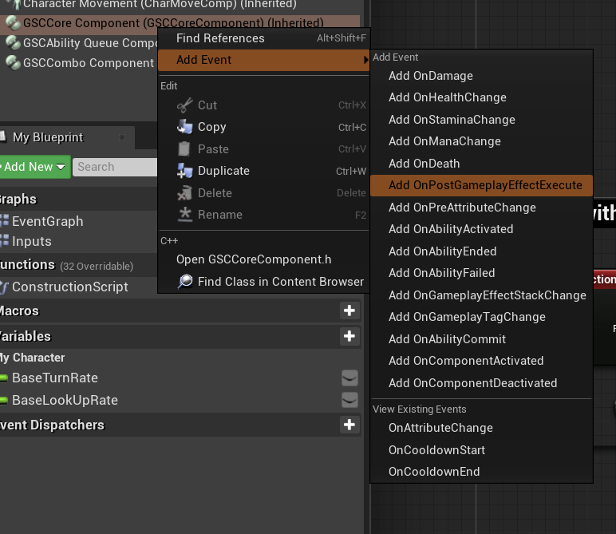

Alternately, you can also use the details panel with `GSC Core Component` selected

You'll be granted with the corresponding {{ "GSCCoreComponent#onpostgameplayeffectexecute" | api }} event node.

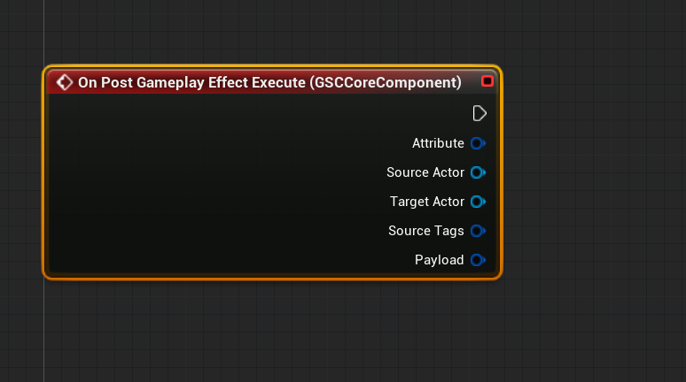

This is the ideal place to perform action like `Clamp` on your attributes. For instance, if you want your attributes to always have values within a certain range.

This is already done for the "default" Attributes (Health, Stamina, Mana) but any new attributes you generated via the [Attributes Class Wizard]({{ "/attributes/attributes-wizard#add-attributeset-c-class-wizard" | url }}) may need special care here.

Drag off the pin for `Attribute` and type `Switch on Gameplay Attribute`.

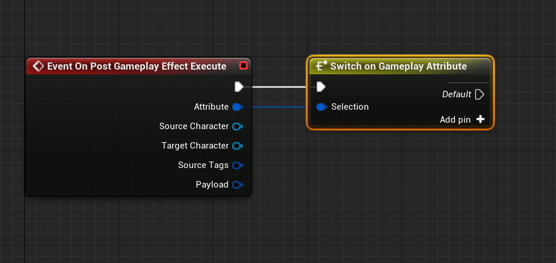

This is a custom GAS Companion node made to ease the process of branching conditions in Blueprints based off Gameplay Attributes. Select the switch node, and define new Cases in the details panel (on the right of the Blueprint Graph by default) by clicking the `+` icon next to "Pin Attributes".

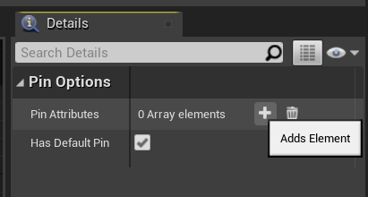

And select the Gameplay Attribute you want to define as a test case.

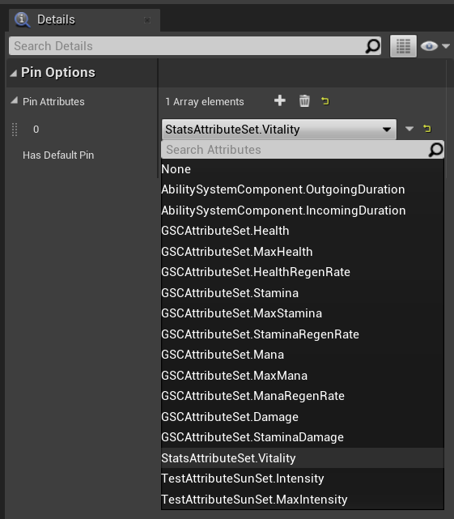

In this instance, this is going to be `StatsAttributeSet.Vitality` we generated in the previous page.

Now, drag off the switch test case and type {{ "GSCCoreComponent#ClampAttributeValue" | api }}.

This helper function is made to do what you would usually do in the `PostGameplayEffectExecute` method of your AttributeSet in c++. Choose the Attribute you want to affect, and the minimum / maximum values.

If you have an associated MaxAttribute, you can use it for the higher bound of the clamp with the {{ "GSCCoreComponent#GetAttributeValue" | api }} function.

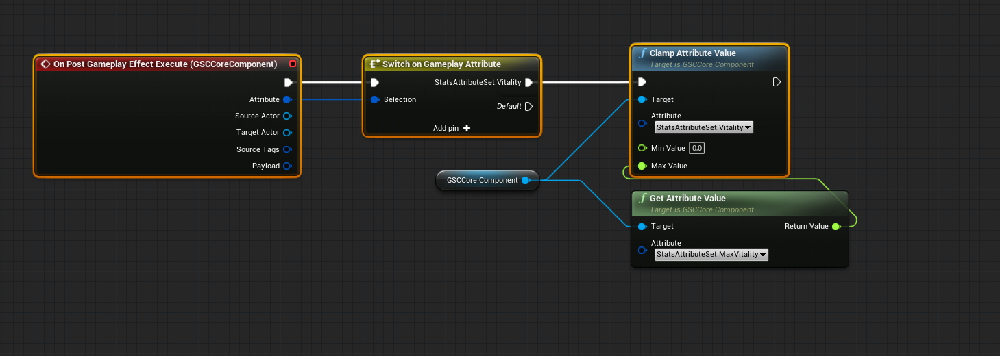

If you have an associated MinAttribute, you can use that as well using the same method (but make sure to plug the return value of the Attribute getter to the Min Value pin)

You can add as many Attribute switch case as you want, and clamp all the attributes you wish. To improve readability, it is then advised to collapse some of those nodes in their own Blueprint function.

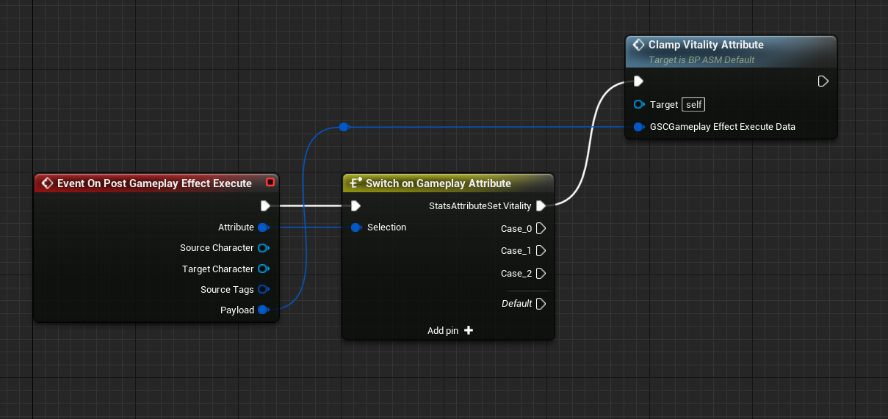

### PreAttributeChange

This event is commonly used to adjust the value of an Attribute when its Max associated Attribute change. For instance, you have the Vitality Attribute current value set to 40% of MaxVitality Attribute value (eg. Vitality: 50, MaxVitality: 200).

If the MaxVitality Attribute changes (with a level up or another Gameplay Effect), you might want to adjust the value of Vitality to reflect that. Let's demonstrate that use case.

***Note:*** *"Default" attributes PreAttribute change for Health, Stamina and Mana is already handled by the plugin.*

Like we did for the PostGameplayEffectExecute, implement the {{ "GSCCoreComponent#OnPreAttributeChange" | api }} event node (by selecting `GSC Core Component`) and create a `Switch on Gameplay Attribute` node, followed by an {{ "GSCCoreComponent#AdjustAttributeForMaxChange" | api }} function call.

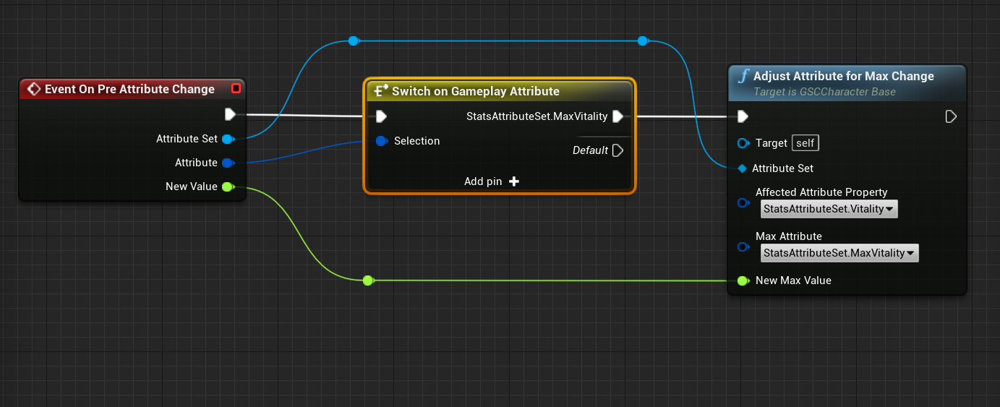

Make sure to react to **Max Attributes** though and to affect the related attribute. It's easy to enter an infinite loop if you misuse attributes there, in which case the Engine will warn you.

In this case, we only react when MaxVitality changes, and we adjust the related Vitality attribute using MaxVitality as the Max Attribute parameter of {{ "GSCCoreComponent#AdjustAttributeForMaxChange" | api }}. Lastly, we use the `NewValue` float from the event as the `NewMaxValue` of {{ "GSCCoreComponent#AdjustAttributeForMaxChange" | api }}.

## Test in Game

### Test the Clamp (in PostGameplayEffectExecute)

Initialize the value of your attributes with a Gameplay Effect, and set this effect as the `Startup Attributes` of your character (if you haven't one already)

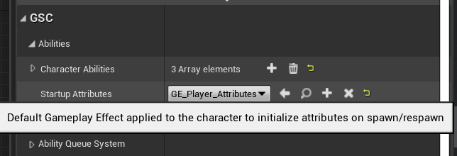

Here's the attribute modifiers from my `GE_Player_Attributes` effect.

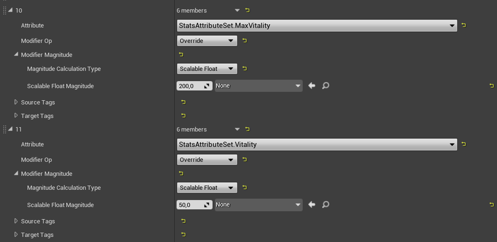

First, we'll test the clamping we did in {{ "GSCCoreComponent#onpostgameplayeffectexecute" | api }}. We'll create a regen Gameplay Effect for this purpose. It'll continuously increase the Vitality Attribute, until it reaches the MaxVitality value.

Create a new Gameplay Effect.

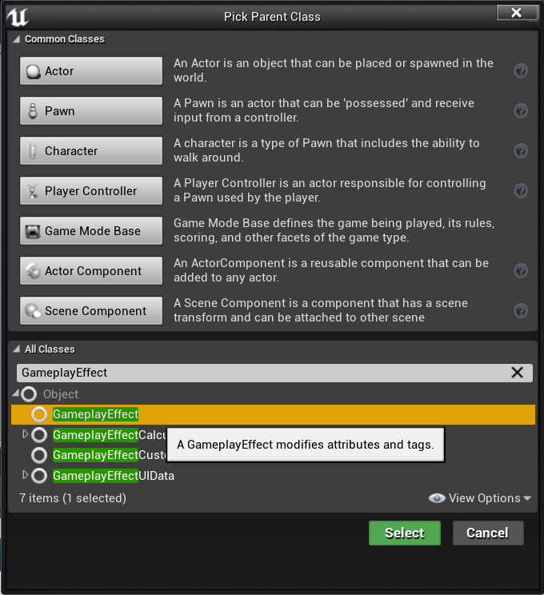

With `Infinite` Duration, a period in seconds and an Attribute `Additive` modifier for `StatsAttributeSet.Vitality` and a scalable float.

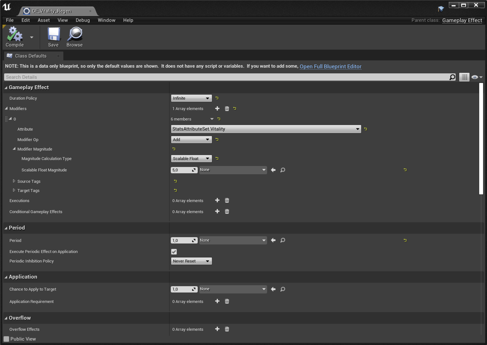

*Here, we add 5 Vitality every 1 seconds*

Add this Gameplay Effect to your `Startup Effects` array on your character.

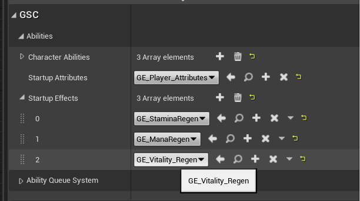

Now, launch the Game in PIE (Play in Editor) and use the `showdebug abilitysystem` command. Type `²` within the game to open the command prompt.

You should see the Vitality attribute going from 50 to 200 (the MaxVitality value) if we did everything correctly. If we didn't clamp, Vitality would increase forever.

### Test the Adjustment (in PreAttributeChange)

We'll now do a similar setup, but instead of creating a regenerate effect, we'll create a GameplayEffect that increase the MaxVitality attribute to apply when we hit a Keyboard input, to see if the related Vitality value is changed accordingly.

First, let's create the test GameplayEffect. This is going to be an `Instant` GameplayEffect with `StatsAttributeSet.MaxVitality` as an `Additive` modifier and a scalable float magnitude of `100`.

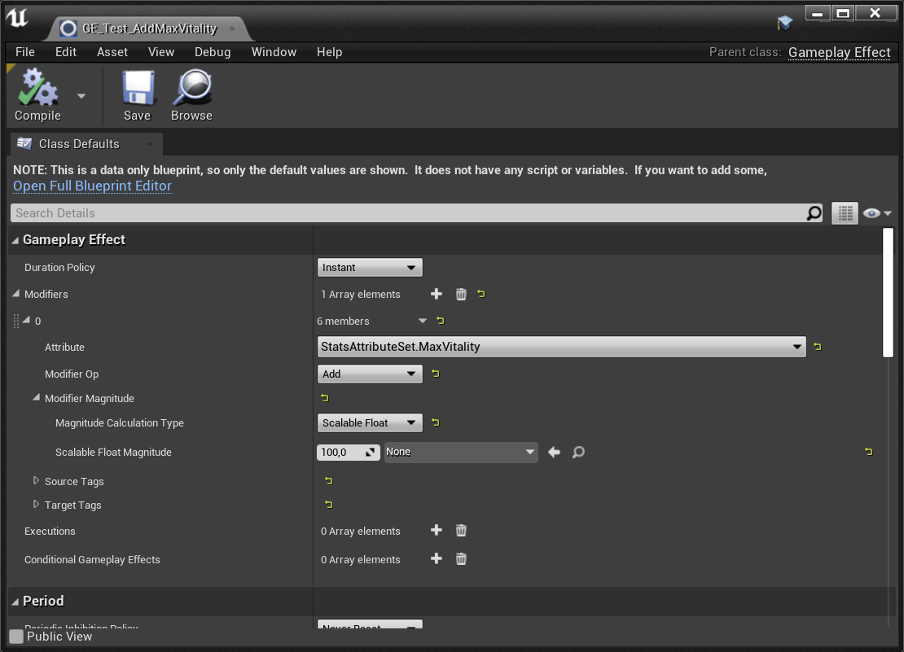

Now, open your character Blueprint and add a Keyboard input event of your choosing. From there, drag off the input event and implement the following: 

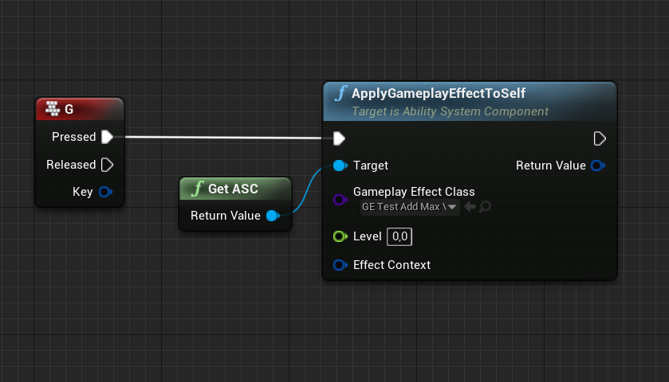
***Note** `GetASC` has been deprecated and removed since this guide was written. Replace it with `GetAbilitySystemComponent` method available in Gameplay Abilities Blueprint library, and passing `self` reference for the Actor parameter.*

Make sure to configure your test GameplayEffect in the `Gameplay Effect Class` parameter.

We can now launch the game in PIE mode, open the gameplay debugger with `showdebug abilitysystem` command and hit the Keyboard input we added (maybe remove the Vitality regeneration effect from the character's Startup Effects so that it doesn't interfere with our testing).

The Vitality attribute should change anytime we hit the keyboard input, keeping its relative ratio to MaxVitality.

This concludes the introduction of AttributeSet Events exposed to Character Blueprints.

