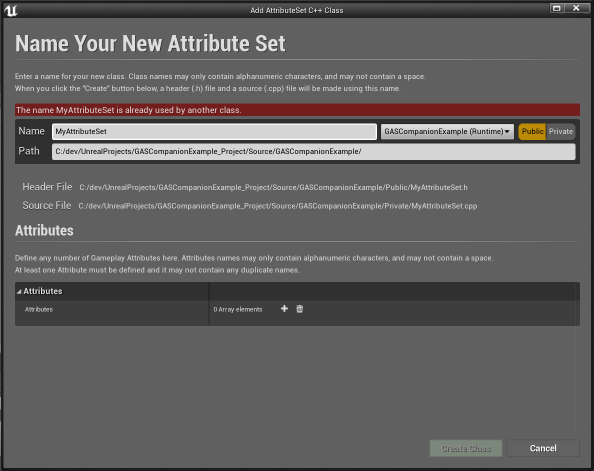
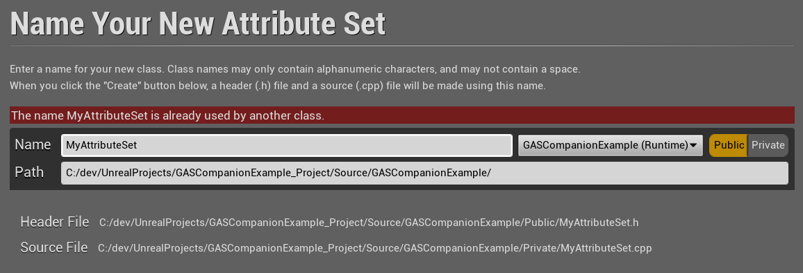
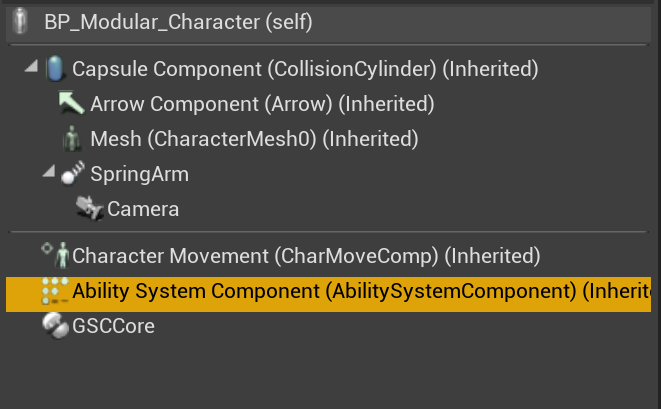

The `1.2.1` version of GAS Companion introduces an Editor Module, which adds a new dropdown menu in the Level Editor Toolbar.


From there, you can get quick access to the [Plugin Configuration in Project Settings]({{ "/configuration" | url }}), View online documentation, [Join our Discord Server](https://discord.gg/d4rs4vcX6t) or [Send an email for support](mailto:daniel.mickael@gmail.com?subject=GASCompanion).

More importantly is the addition of a custom AttributeSet C++ Class creation wizard. Click the `New C++ AttributeSet Class...` button from the dropdown menu.

<div class="notes">

Keep in mind, that in order to be able to generate C++ classes and use the Wizard, you need Visual Studio installed and the compiler toolchain that goes with it. Prior to using the wizard, you'll have to go through the process outlined here: https://docs.unrealengine.com/5.1/en-US/setting-up-visual-studio-development-environment-for-cplusplus-projects-in-unreal-engine/

Which you can then validate you did it properly with Unreal's default class wizard available in `Tools > New C++ Class` and try to create a dummy Actor or "None" class. If you're able to generate and compile, you're good to go.

</div>

## Add AttributeSet C++ Class Wizard

With GAS, one of the only thing that requires C++ no matter what is the creation of AttributeSet and Gameplay Attributes. This is the main blocking point for non c++ programmers willing to use GAS in their project.

This AttributeSet C++ Class generation feature aims to alleviate that.



It works the same way as the standard Editor `New C++ Class...` action from File Menu or Content Browser, except it is customized to generate a valid AttributeSet with the Gameplay Attributes you can configure through the Class creation dialog.

Here is a quick demonstration of the creation of a new AttributeSet:

https://youtu.be/heaTnGvBZHA

### Configure Class name and path

Define here the name for your new AttributeSet class, and its location. You can choose in which C++ module you want it to be generated (eg. all the local C++ module for your game and plugins, when in doubt use the default value which is your main game module).



The wizard will warn you if the name / path are invalid, or if the Class name is already used.

### Configure the Gameplay Attributes to generate

Next, you need to define at least one Attribute for your new AttributeSet.

Click the `+` icon next to the `Attributes` property, and configure here the Attribute Name, its default value and Category specifier.


Attributes must have a valid name (cannot contain space, must begin with alphabetic character, etc.) and cannot contain duplicates (several attributes with same name).

You can define a default value for the Attribute, before it gets initialized or modified by a Gameplay Effect.

Lastly, the Category specifier is optional. It is the standard Category property specifier defined with UProperties (`Category="TopCategory|SubCategory|..."`).

> Specifies the category of the property when displayed in Blueprint editing tools. Define nested categories using the | operator.
> ~ [Property Specifiers](https://docs.unrealengine.com/en-US/ProgrammingAndScripting/GameplayArchitecture/Properties/Specifiers/index.html)

Gameplay Attributes are replicated by default, and will work for both Single Player and Multiplayer scenarios.

### Generate!

When you're ready to start the generation process, click the `Create Class` button. If it is disabled, it means that there are some validation errors you need to fix beforehand.


The engine will start adding code to your project


And try to compile the project


If the compilation goes fine, the engine will hot reload your project and you'll be able to use your new Attributes right away.

### Notes on Build.cs

If there is a compilation error, this is most likely due to the fact you already have a c++ project, and don't have `GASCompanion` and related GAS modules in your `Build.cs` file. The generated AttributeSet inherits from `GSCAttributeSetBase` which requires you adding `GASCompanion` module dependency to your game module (as well as `GameplayAbilities`, `GameplayTasks` and `GameplayTags`)

```clike title=YourProject.Build.cs
PrivateDependencyModuleNames.AddRange(new string[] {
    "GASCompanion",
    "GameplayAbilities",
    "GameplayTasks",
    "GameplayTags"
});
```

Once done, re-compile.

**Note** *For non code project (eg. pure Blueprint), the Wizard will create basic source code module for your project and handle the generation of a valid `Build.cs` file for you.*

The Editor will open the newly added class header / source files in your IDE, which you might inspect or edit as you see fit.

## Test the newly added Attributes

To quickly test the Attributes you generated, create or edit an existing Gameplay Effect and check if you see them in the modifiers list.


Now, to properly use this new AttributeSet, you need to grant it to your Characters' ASC. You can can do so  **per** actor directly on the Ability System Component properties in Blueprints.

### AttributeSet Configuration

Adding and granting a new AttributeSets for your Pawns is pretty straightforward. 

1. Navigate and open the Blueprint for your Character or Pawn (or PlayerState if you're using it to hold the Ability System Component)
2. Click on the Ability System Component in the Components view



3. In the Details panel, under `GAS Companion | Abilities`, click on the `+` icon next to `Granted Attributes` and fill in your newly created Attribute Set(s)


4. Optionally, you can use a DataTable to fill in the `Initialization Data` to set default values for your Gameplay Attributes. You can find more details for doing so in the [Getting Started section]({{ "/quick-start/#initialization-with-data-table" | url }}).