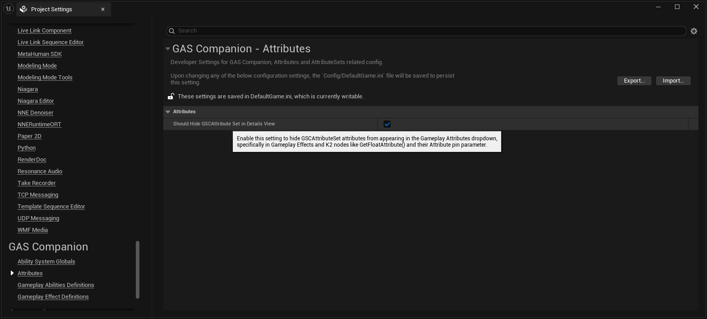
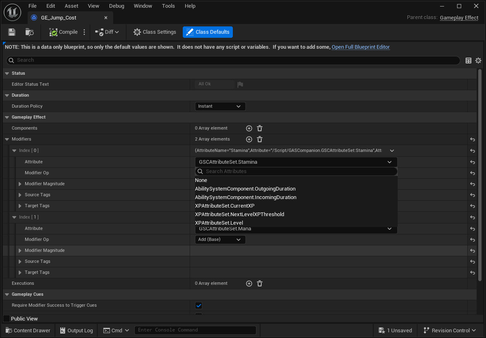
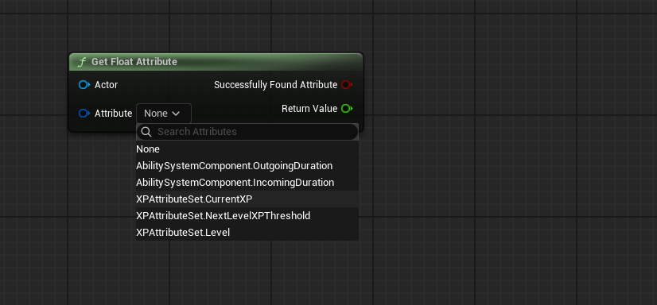
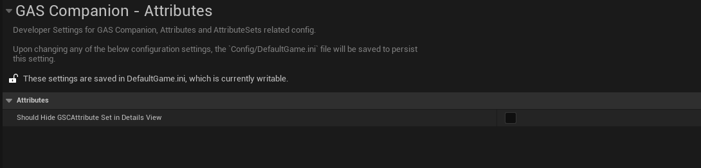
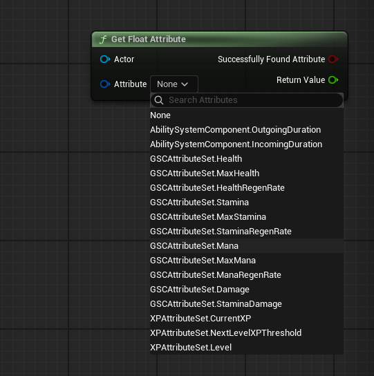
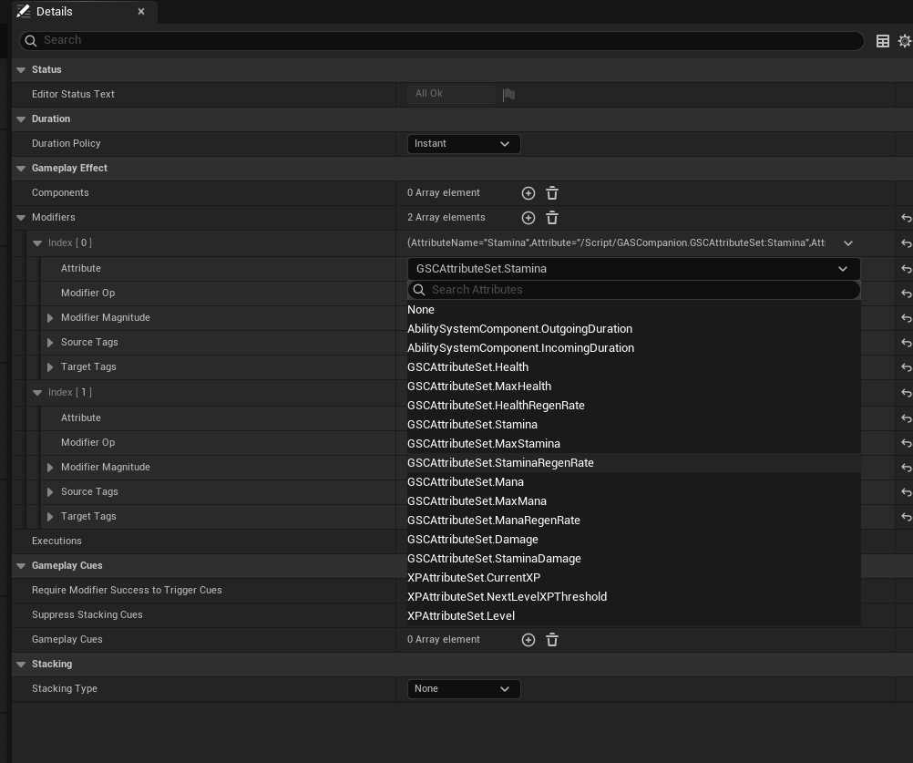

*[on December 2nd, 2024](https://github.com/GASCompanion/GASCompanion-Plugin/pull/94)*

## Added option to hide and filter GSCAttributeSet in attribute dropdowns

With a new DeveloperSettings category available under `Project Settings > GAS Companion > Attributes` category.

And `bShouldHideGSCAttributeSetInDetailsView` setting. When turned on, this will add (or remove when turned off, the default value) the `HideInDetailsView` metadata on the GSCAttributeSet UClass, which the engine details customization and slate widgets is checking to filter out attributes or attribute sets.

On editor start, the metadata will be added programatically if this setting is turned on.

#### Example with HideInDetailsView turned on

or with K2 Nodes that have an Attribute pin parameter:

#### Example with HideInDetailsView turned off (default value)

When turned off (the default behavior)

