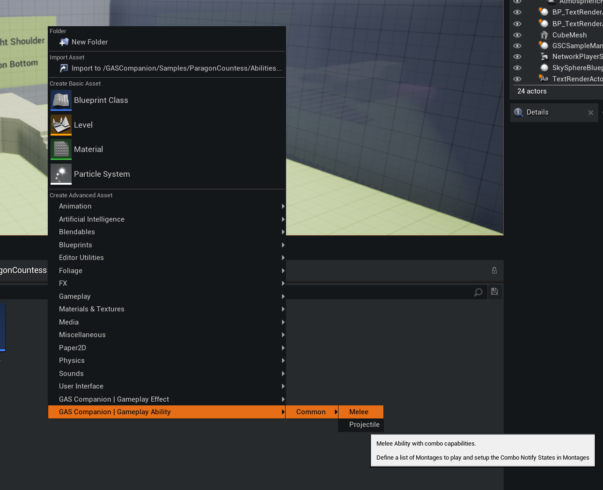
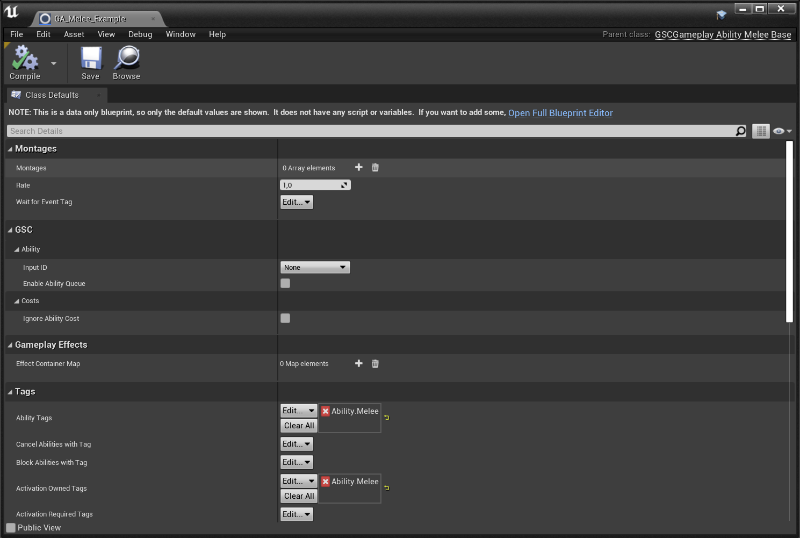
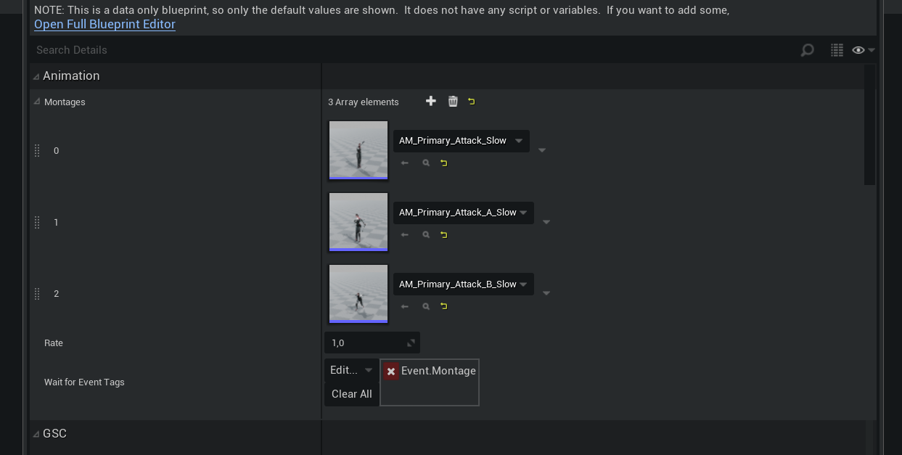
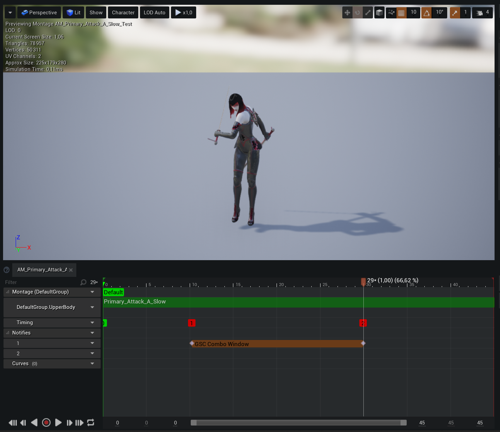
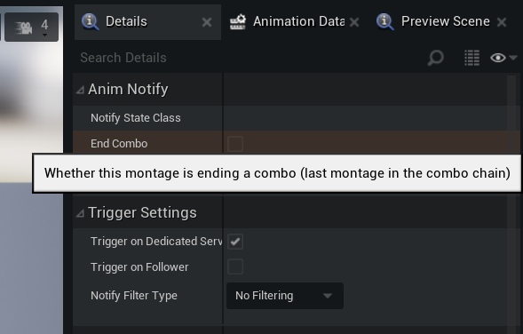
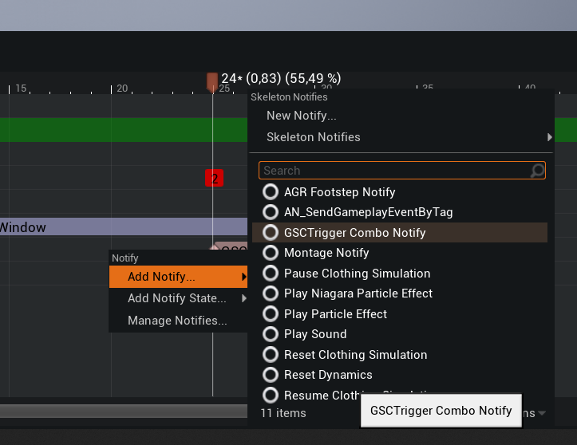
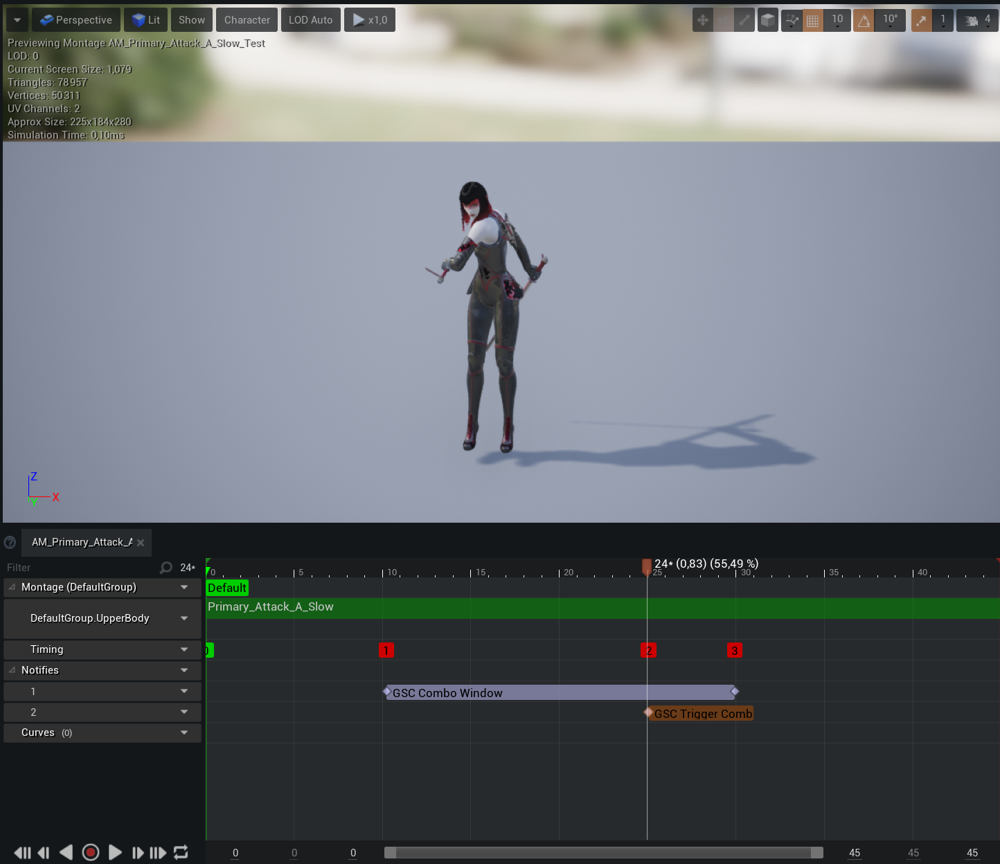
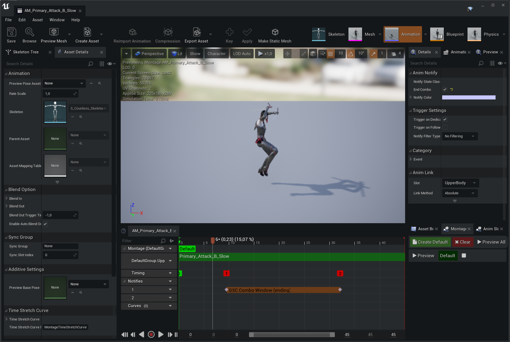
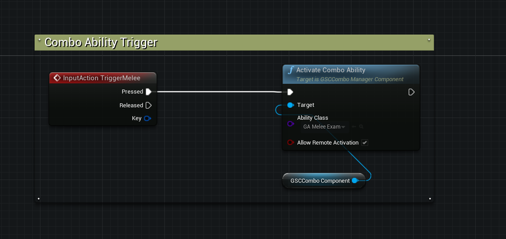
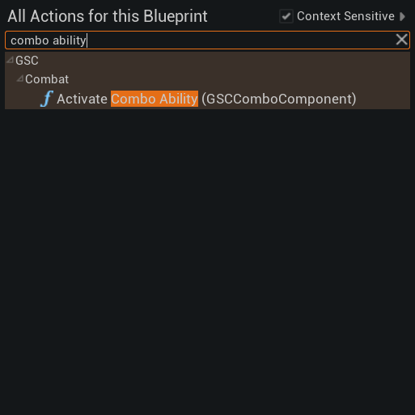

Introduced in 2.0.0 version of the plugin, `GSCGameplayAbility_MeleeBase` is a GameplayAbility c++ class you can subclass and quickly create melee combo for your characters.

Creating a new melee combo ability requires the following steps:

- Create a new GameplayAbility child blueprint from `GSCGameplayAbility_MeleeBase` and edit parameters
- Grant the ability for the Character(s) you wish to activate it for
- Add the combo notifiers in your animation montages
- Add `GSCComboManager` component to your Pawn Blueprints
- Add `GSCCore` component to your Pawn Blueprints
- Activate the ability in your character blueprint via {{ "GSCComboManagerComponent#ActivateComboAbility" | api }} method on the Combo Manager Component

**Quick demo**

## Create Melee Ability

Right click in the Content Browser, and create a new `Gameplay > Gameplay Ability Blueprint`.

Choose `GSCGameplayAbility_MeleeBase` as your parent class

Alternately, you can use the custom context menu GAS Companion adds with [Gameplay Ability Definitions]({{ "/config/ga-definitions" | url }}).

Name it with something that suits you, in this example it is going to be `GA_Melee_Example`.

`GSCGameplayAbility_MeleeBase` child blueprint are meant to be data only blueprint, the ActivateAbility implementation is handled by the parent class.

You can then open the blueprint to see the parameters exposed. Since it is a data only blueprint, you can close and reopen it to get the Class Defaults panel maximized.

The parameters you want to tweak are below the "Animations" category at the top.

- Montages: List of animation montages you want to cycle through when activating this ability
- Rate: Change to play the montage faster or slower
- WaitForEventTags: Any gameplay events matching this tag will activate the EventReceived callback and apply the gameplay effect containers for this ability

## Adding Animation Notifiers to Montages

The combo system relies on two Animation Notifiers:

- `GSCComboWindowNotifyState` Opens the combo window during which players can register the activation of the next part of the combo
- `GSCTriggerComboNotify` This is the point where if you have queued another input, the notify tells it to switch to the next combo
Montage

In Persona, the animation editor with your montage opened, right click within one of your notify track and add a `GSCComboWindowNotifyState` Notify State

Adjust the start and end frame of the notify by dragging the handles around, where you want to allow player to activate and register combo input.

This notify state exposes a single parameter `End Combo` which must be turned on for the last montages of the combo chain. It tells the system to reset the combo component state when the montage ends.

Then you want to place a single `GSCTriggerComboNotify` notify at the exact time you want to trigger the next combo if the player queues an input anywhere within the Combo Window.

Make sure that both notifiers overlap, the trigger notify **needs** to be within the Combo Window. The trigger combo won't activate the ability only when the combo window is opened.

The end result should look like

Don't forget to "end" the combo in your last montages by turning on the Combo Window Notify State parameter `End Combo` in the details panel (when the notify state is selected in Persona)

## Activate Combo Ability

We're almost done. The last step is to actually activate the ability from your Character Blueprints.

This must be done via the Combo Manager Component {{ "GSCComboManagerComponent#ActivateComboAbility" | api }} method.

You can right click in your Blueprint graph and search for "combo ability"

## Debug Combo Widget

The combo system comes in with a simple "Debug" widget, similar to the ability queue debug widget.

You can show / hide it with `GASCompanion.Debug.Combo` command

## Multiplayer

The melee combo ability is working in a networked environment and is resilient to network lag up until something like 200-250 ping.

