https://youtu.be/yWOnfzufkag

---

For the purpose of this guide, we'll rely on the Third Person Character Template of Unreal in a blank new Blueprint project. You can either create a new Project using this template, or add it later on with `Add/Import > Add Feature or Content Pack > Blueprint Feature > Third Person`.

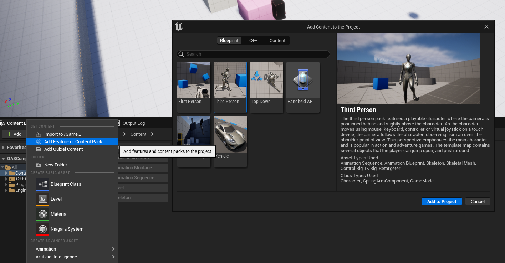

---

## Setup Map and Game Mode

First thing we're going to do is to create our own gameplay debug map by duplicating the default map in the Third Person Template.

Navigate to `/Content/ThirdPersonBP/Maps` and duplicate the map to your desired folder. Here we'll copy paste that map to `/Content/GettingStarted/Maps`. Then open it up, we'll go now over the creation of a Game Mode for our newly created map.

**Warning** Before going through the creation of a new Game Mode, make sure to remove the `ThirdPersonCharacter` Actor from the map we copied over. By default, it is setup to auto possess player and will completely bypass our Game Mode Pawn Class.

Right click anywhere within the Content Browser to bring up the File context menu, and select new `Blueprint Class` and choose `GameModeBase` as the parent class.

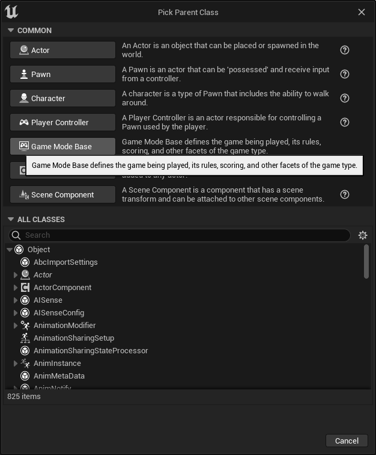 

We're going to call this Blueprint `BP_GameMode`. GameModes are important classes that allow you to configure which class to use in your Maps, for various part of the Gameplay Framework such as:

- Player Controller
- Player State
- HUD Class
- Default Pawn
- etc.

For the purpose of this guide, the two most important ones are `Default Pawn Class` and `Player Controller Class`

- `Default Pawn Class` -> Needs to be a child of either: `GSCModularCharacter`, `GSCModularPawn` or `GSCModularPlayerStateCharacter`. In the next chapter, we'll create a new `GSCModularCharacter` Blueprint.
- `Player Controller Class` - Needs to be either `GSCModularPlayerController` or a child of it. You can set the class to `GSCModularPlayerController` now, we don't need to create a BP derived class there. This parent class is mostly needed to be able to respond to handle some events from Pawns, specifically for Input Binding and the new Enhanced Input integration in GAS Companion v3.

Now, we need to configure our Map to use this `BP_GameMode`. To do so, go into your World Settings Panel (if you don't see it, open it with `Window > World Settings`) and select your GameMode in `GameMode Override`.

## Setup Pawn Class (Player Character)

In this example, we're going to use Epic's Third Person Blueprint Template.

If you haven't started your project using this template, add it now with `Add / Import > Blueprint Feature > Third Person` from the Content Browser.

### Create new Modular Character Blueprint

**Note** If you want to skip all this section, you can reparent the `ThirdPersonCharacter` directly to `GSCModularCharacter`.

Open `ThirdPersonCharacter` Blueprint (by default located in `Content/ThirdPersonBP`), we won't make changes to it but it's going to be handy to have so that we can copy part of it to the new Character Blueprint class we're about to create.

Now, like we did for the Game Mode, right click anywhere in the Content Browser to bring up the File Context Menu, choose new `Blueprint Class`, and this time, make sure to select `GSCModularCharacter` as the parent class. Name it however you wish, here I'm gonna use `BP_Modular_Character`.

Open up the newly created BP, and setup the following:

1. Setup Mesh and Anim BP: From the components view, Click on the Mesh component and
    1. Set the Skeletal Mesh to the same used in `ThidPersonCharacter`: `SK_Mannequin`
    2. For the Anim Class in the Animation category, do the same and select `ThirdPerson_AnimBP` from the template.
    3. Edit the Location Z value to be `-88`
    4. Edit the Rotation Z value to be `-90`
2. Create Camera: Select both `CameraBoom` and `FollowCamera` components in `ThirdPersonCharacter`, copy with `Ctrl+C` and paste them in the new `BP_Modular_Character` Blueprint.
3. Setup Movement Rotation:
    1. Select the Character Movement component, search for `Orient Rotation to Movement` and make sure it is enabled.
    2. In the Class Defaults (the settings for the Character itself), search for `Use Controller Rotation Yaw` and make sure it is disabled.
4. Setup Movement Inputs:
    1. From the `ThirdPersonCharacter`, locate and select in the Event Graph all the input nodes. Copy and paste them in our new Blueprint.
    2. From the `ThirdPersonCharacter`, copy and paste both `BaseTurnRate`, `BaseLookUpRate` variables into our new Blueprint.
5. Compile and Save.

### Update GameMode Default Pawn Class

Now that the Character Blueprint is done, make sure to tell the Game Mode to use it as a `Default Pawn Class`.

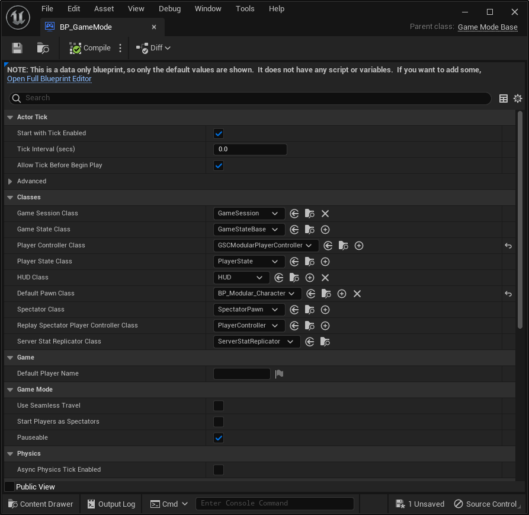

If we hit play now, we have a working character with an Ability System Component attached to it, without any Attributes or Abilities yet.

## Ability System Component

### Overview

`GSCAbilitySystemComponent` is a child of `AbilitySystemComponent` from GAS, and automatically created for you in `GSCModularCharacter` and `GSCModularPawn` (as well as `GSCModularPlayerState` if you wish to have ASC living on PlayerState)

It exposes some properties available in `Modular GAS Companion | Abilities`. If you select the component from the components view, you'll be able to see and edit those to:

- `Grant Abilities` - List of Gameplay Abilities to grant when the Ability System Component is initialized, with an optional Enhanced Input Action to bind the ability activation to.
- `Grant Attributes` - List of Attribute Sets to grant when the Ability System Component is initialized, with optional initialization data.
- `Grant Effects` - List of GameplayEffects to apply when the Ability System Component is initialized (typically on begin play)

**Note** If you're used to GAS Companion v2, those were part of `GSCCoreComponent`, which is still available. It's just now that those BP exposed properties in Core Component are getting deprecated since they're a bit redundant with the new setup.

#### Granting Attributes

Unlike in previous version, where Attribute Sets to grant to actors were configured in Project Settings, you now have the possibility to configure and grant attribute sets **per** actor. Another difference is that now the default `GSCAttributeSet` is not added by default to Modular Actors.

`GSCAttributeSet` is an Attribute Set coming with GAS Companion with commonly found Gameplay Attributes such as `Health`, `Stamina` and `Mana` (and their associated Max attribute).

#### Granting Abilities

To activate abilities for a given Actor, they must be "granted" before being used.

The `GrantedAbilities` property lets you specify a list of Gameplay Ability to Actor's Ability System on spawn.

This is a list of Gameplay Abilities with an optional Enhanced Input Action to bind the activation of the ability to.

#### Granting Effects

The `GrantedEffects` lets you specify a list of Gameplay Effects to apply to the Actor on spawn, typically on Begin Play. This is useful to setup some Infinite, always running, Gameplay Effect for your actor such as regeneration effect. We'll cover that by creating a Stamina Regen effect later on.

## Granting Player Attributes

### Adding GSCAttributeSet

In this section, we'll describe how we can grant this Attribute Set to our Player Character and initialize the default Base values of each Attributes.

1. Next to the `Granted Attributes`, click the `+` icon to add a new entry.
2. For the `Attribute Set` value, choose `GSCAttributeSet`

If you hit play now, and open up the gameplay debugger for GAS with `showdebug abilitysystem`, you should see each Gameplay Attribute we just configured by configuring the Ability System Component to use `GSCAttributeSet` for this actor.

If you have other AttributeSets you'd like to grant to the character, or even use instead of `GSCAttributeSet`, simply add them here in the `Granted Attributes` list.

### Initialization with Data Table

They're all with their default `0` value. Let's change that by creating a DataTable to initialize them. From the File Context menu, choose `Miscellaneous > DataTable`

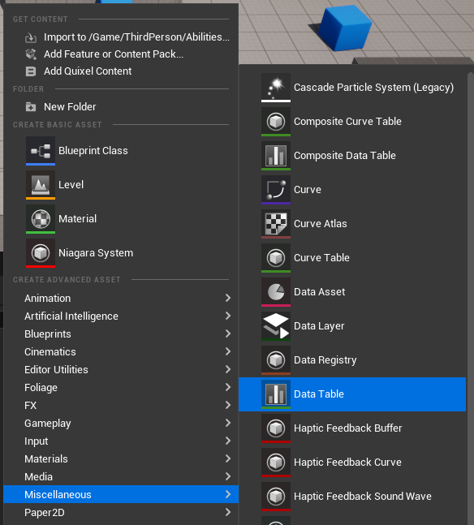

And in the next window, make sure to select `AttributeMetaData` for the Row Structure.

Give it a name and open it up. I'm using `DT_Player_Attributes` in this case.

From there, you can click the `+ Add` icon in the toolbar for all the attributes you want to initialize. The first two columns are the ones we want to setup:

- `Row Name` -> Needs to follow a specific syntax which is the name of the Attribute Set class and Gameplay Attribute value, separated by a dot (`GSCAttributeSet.Health`)
- `Base Value` -> Is the actual float value for the Base and Current value of the gameplay attribute.

**Note** Other columns as far as I can tell are not implemented right now in engine. But that's something project specific code could leverage to adjust clamping done in Attribute Sets for instance.

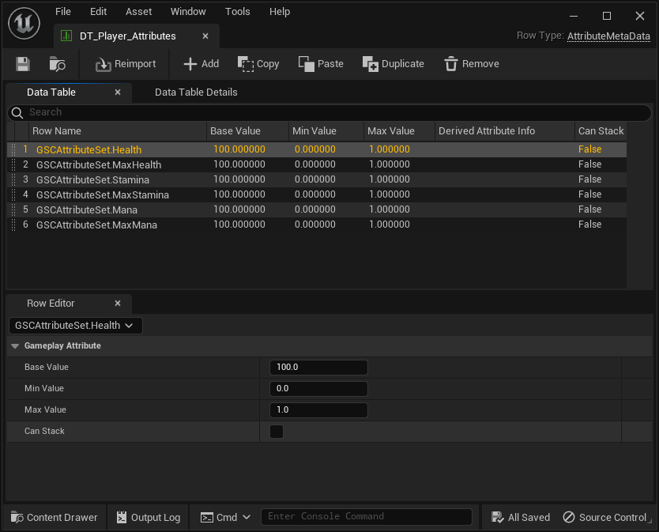

If you hit play now, and open up the gameplay debugger for GAS with `showdebug abilitysystem`, we should see values for each Gameplay Attribute we configured in the Data Table updated accordingly.

## Create HUD

Before going through the setup of a new Ability and Gameplay Effect cost for our ability to spend some Stamina on jump activation, it would be nice to see the values of our Attributes visually on the screen (without having to use the gameplay debugger).

Now is a good time to talk about Player HUD and create the widget on Begin Play.

Compared to previous `v2` version and setup, the HUD Widget is not created automatically anymore with Modular Actors to provide more flexibility and control to where and when you want the HUD widget to be created and added to the player screen.

Fortunately, it is very easy to handle. On Begin Play, simply create a new widget and add it to the player screen. The UMG widget to use **must** be a child of `GSCUWHud` which is the case of `WB_HUD...` widgets provided with GAS Companion (more information in [Working with UI]({{ "/working-with-ui/" | url }}))

Which should result in

And if we test that in multiplayer (clients or listen server), we should see the following (you could even slightly adjust the Data Table we created before to see how it affects the progress bars).

Even though it is not strictly necessary, I would highly recommend that you pass in the `Owning Player` reference to the Pawn Player Controller. It will handle the creation of the Widget only on client since the following cast to Player Controller will silently fail on server for clients.

## First Ability - Jump

In this section, we'll implement our first ability. To keep things simple, it is going to be a Jump ability and will cost a set amount of Stamina to activate.

For now, our jump mechanism is done in `BP_Modular_Character` BP, which is coming from the Third Person Template (if you copied over the inputs from `ThirdPersonCharacter`).

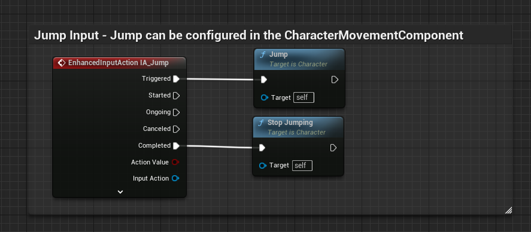

This is pretty simple, just calling out the `Jump` method from Character when the input action Jump is pressed by the player.

Let's refactor and replicate this within a Gameplay Ability.

To create a new Gameplay Ability Blueprint, navigate to where you'd like to create it and use the File Context menu `Gameplay > Gameplay Ability Blueprint`.

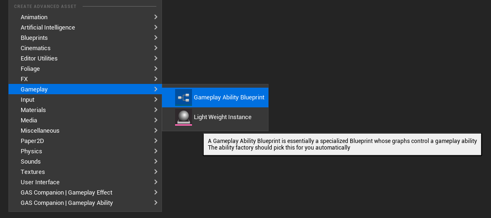

And in the next window, pick up the parent class.

You can either choose `GameplayAbility` or `GSCGameplayAbility`.

### Notes on GSCGameplayAbility

`GSCGameplayAbility` is a Companion specific subclass of `GameplayAbility`, and is recommend to use with GAS Companion.

Added functionality compared to regular `UGameplayAbility` includes:

- GameplayEffect containers: https://github.com/tranek/GASDocumentation#concepts-ge-containers
- Ability Queue System support: If you intend to use Ability Queueing, you should rely on this class for your Abilities
- Loosely Check for Cost: If you'd like your abilities to activate regardless of cost attribute going into negative values, and only checking if cost attribute is not below or equal to 0 already.
- End delegate: A blueprint assignable delegate is exposed which is triggered on ability end. Particularly useful for AI Behavior Tree tasks.
- Activate On Granted: Support for "Passive" abilities, an ability that automatically activates and run continuously (eg. not calling EndAbility).

For the purpose of this tutorial, it is not strictly needed and you would be fine with going with just `GameplayAbility`.

### Gameplay Ability Blueprint

Name the Ability Blueprint `GA_Jump` and open it. From there, you'll see two events you can implement `ActivateAbility` and `OnEndAbility`.

We basically want to trigger the `Jump` method from our Character in the `ActivateAbility` event. To do so, wire up your Blueprint do be like:

There is two important method to invoke when designing abilities:

- `CommitAbility()` This is where and when resources are checked and applied, such as cooldowns and costs.
- `EndAbility()` Method to invoke when the `GameplayAbility` should terminate, it is important to call this method otherwise the Ability will go on forever, possibly preventing further executions (unless you have an Ability that is meant to run indefinitely, like a passive ability)

`GetAvatarActorFromActorInfo()` lets you get back a reference to the Actor that is owning the ability. Since we want to call `Jump()` on it, a `ACharacter` method, we need to cast the Actor to the appropriate class to be able to do so.

**Note** If you want to call the `StopJumping()` method that was called previously, you can do that with GameplayEvents triggered from the Released pin and use `Wait Gameplay Event` task in your ability **OR** use the input binding system to activate the ability with the new Enhanced Input integration and use `WaitInputRelease` task, that we'll go over shortly after.

Last thing I would recommend you to do is to change the `Instancing Policy` of the Ability to `Instanced Per Actor`. It will basically tell the system that only one instance of this ability can be active at anytime for the owner of the ability. Which makes sense for a basic jumping ability.

You can find those settings in the `Class Defaults` and the `Advanced` category.

### Granting Ability

We can test if our newly created Ability is working.

First thing first, we need to grant the ability to our Character (actually to its Ability System Component). Go back to the Character BP, and:

1. Select the Ability System Component from the components list
2. In the `Modular GAS Companion | Abilities` category, click the `+` icon close to `Granted Abilities`
3. Expand the entry to see both `Ability` and `Input Action` properties
4. For `Ability`, pick up the `GA_Jump` ability we just created

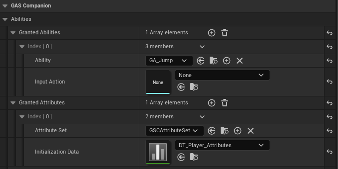

### Manual Activation

We need to activate it somehow, we can simply use the `InputAction Jump` in our Character BP to do that.

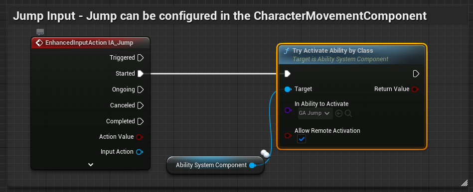

We can use the Ability System Component `TryActivateAbilityByClass` method.

If you hit play now, you should be able to see the character jumping when you press Spacebar.

## Using Input Binding with Enhanced Input

Now, we'll rework the way we activate the ability to do that with the automatic input binding available in v3 using the new Enhanced Input integration.

### Project Setup

Before being able to use it though, we have a bit of Project setup to do. Open up the Project's Setting and navigate to `Engine > Input` category.

There, make sure you are using

- `EnhancedPlayerInput` for the `Default Player Input Class`
- `EnhancedPlayerInputComponent` for the `Default Input Component Class`

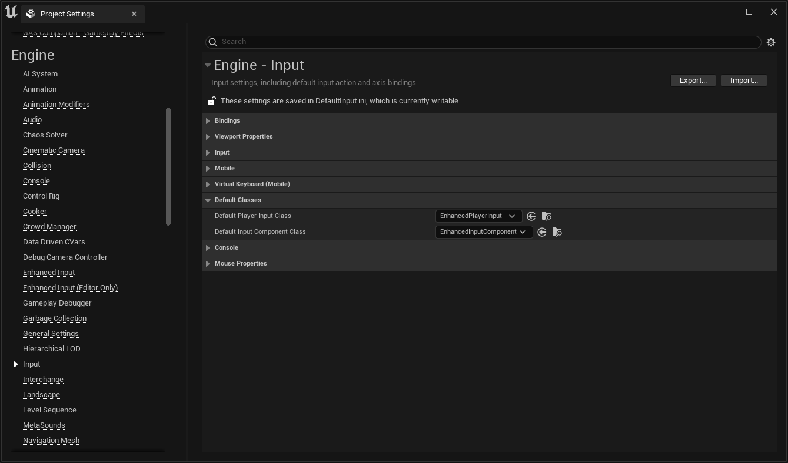

**Note** You'll be able to find a lot more information on the official documentation for Enhanced Input ([4.27](https://docs.unrealengine.com/4.27/en-US/InteractiveExperiences/Input/EnhancedInput/) / [5.0](https://docs.unrealengine.com/5.0/en-US/GameplayFeatures/EnhancedInput/) the 5.0 documentation has more information about Blueprint setup and usage)

### Ability Input Binding Component

If you take a look at the mentioned official docs, you'll see that you need to Add an InputMapping context to the Enhanced Input Subsystem. That's something we'll handle using an Actor Component: `GSCAbilityInputBinding`.

Click the `Add Component` button in the components panel, and add `GSCAbilityInputBinding` to your Character BP

Aside from being required for the Ability System input binding to work with Enhanced Input, this component allow us to define an Input Mapping Context (something you would need to do manually with Enhanced Input Subsystem).

*Enhanced Input related settings available in `Player Controls` category of `GSCAbilityInputBinding` component*

**Note** If you're using a Game Feature to grant abilities, the `AddInputMapping` action will handle the registering of this component if it is not available on the target Actor class.

### Input Action and Mapping Context

We'll now go through over the creation of the bare minimum assets we need to handle the activation of our Jump Ability via Enhanced Input, and how you can register the Input Action to automatically activate the ability when it is triggered.

1. First, let's create the Input Action. From the Content Browser, right-click and bring up the File Context Menu, and create a new Input Action with `Inputs > Input Action`.

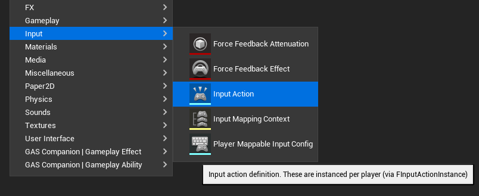

Name it something appropriate like `IA_Jump`. You can open it up to familiarize yourself with Input Action configuration, but the default setup will work just fine for us (eg. will use `Down` trigger by default)

2. Then, we need a Mapping Context, this is where we'll configure the actual binding for the Input Actions. Like we did previously, open up the File Context Menu, and create a new Mapping Context with `Input > Input Mapping Context`

Name it however you wish, here I'm going to use `MC_Player_Controls`. Open up the Mapping Context Data Asset we just created and set it up like so:

### Ability Binding for Jump

Last thing we need to do is to ensure our Pawn has the Mapping Context added to the Player Controller Enhanced Input Subsystem. Go back to the Character BP, select the `GSCAbilityInputBinding` component in the components list, and set the `Input Mapping Context` property to the context we created.

And finally, we can edit the Ability System Component `Granted Abilities` list and the `GA_Jump` entry to use `IA_Jump` for the Input Action.

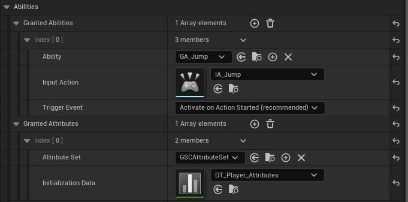

For good measure, make sure to remove the old input binding that we used before to activate the jump ability in the Event Graph, and test it out in game.

You should see the character jumping and the ability activated whenever you hit Spacebar, which triggers the `IA_Jump` input action.

## Rework Jump Ability

Now that we have Enhanced Input setup to activate the ability, we can revisit the ability to invoke the `StopJumping` method on input release. We'll also go over the concept of Gameplay Event to properly handle the ending of the ability whenever the character lands.

### Using Input Release Task

Open up the `GA_Jump` Blueprint, and change it like so

1. First we store a reference to the Character we cast to as `AvatarCharacter` just so we can use it later on, because we now need it in several places (two actually).

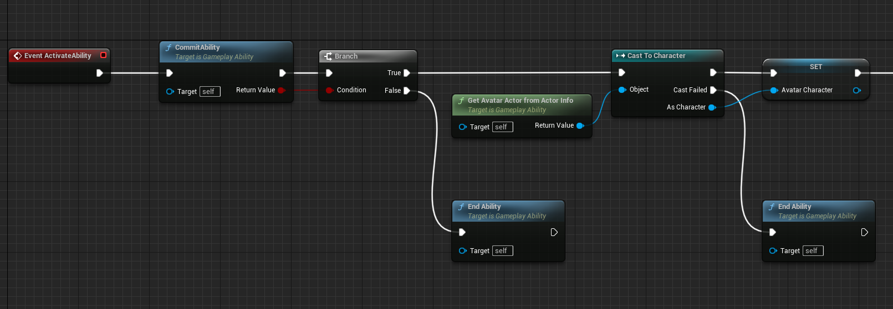

2. Then we use the `Wait Input Release` task to be able to react to it, and call the `Stop Jumping` method, followed by the `Jump` one we used previously.

3. Another slight variation is that we now end the ability after a slight delay (that we'll change quickly after to use a Gameplay Event). If we were to end the ability right after the Jump in a synchronous way, the `Wait Input Release` would be destroyed along the ability and not able to react to our input being released.

If you test it out in game now, you should see the appropriate debug messages "Jump" and "Stop Jumping" printed on screen depending on your input press / release. And if you were to hold the input more than 2 seconds, you wouldn't see the "Stop Jumping" one.

### Using Gameplay Event on Landed

Now, we'll finish up the implementation of the Jump Ability by properly handling the ending of the ability when the character lands on the ground.

To do that, we first register the event `OnLanded` in our Character BP to send a gameplay event to the actor.

1. In the Character BP Event Graph, right click and implement the `OnLanded` event.
2. Drag out the pin and search for `Send Gameplay Event to Actor`
3. For the Actor parameter, make sure to pass in `self` reference to it
4. For the Event Tag, create a new one like `GameplayEvent.Landed`. You can choose to create and use another Gameplay Tag, just make sure to use the exact same later on when we go over the ability.

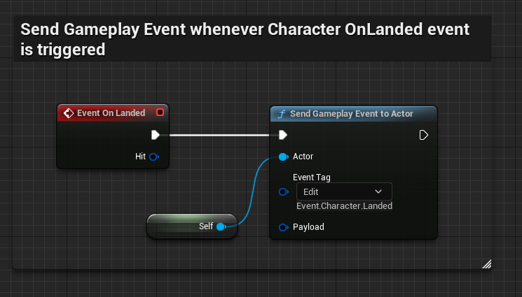

Then, we need to do a final edit to our `GA_Jump` ability.

1. Replace the Delay node with `Wait Gameplay Event`
2. For the Event Tag, use the same one you're sending from the Character Blueprint (here, `GameplayEvent.Landed`)
3. From the `Event Received` pin, drag out and invoke `End Ability`

You can now test it out in game, and should see the "Gameplay Event Landed received, End Ability" debug message whenever the Character lands on the ground, thus ending the ability correctly.

## Stamina Cost

To make things a bit more interesting, let's associate a Stamina cost to this ability.

Costs are applied through GameplayEffects. To associate a Stamina cost with the ability, we need to create the associated GameplayEffect and provide it in the `Cost Gameplay Effect Class` property.

You can quickly create a new GameplayEffect with the little `+` icon next to the property:

Do that now and create the GameplayEffect. In this example, we named it `GE_Jump_Cost`.

You can them specify the attributes that are going to be used as a cost. We make sure to use an Instant Duration Policy and an Additive operation (Add for `Modifier Op`). The float value is configured to be `-40` but feel free to use whatever you want. Just make sure the value is negative otherwise you'd be adding resources on each activation (goes a bit against the notion of "Cost")

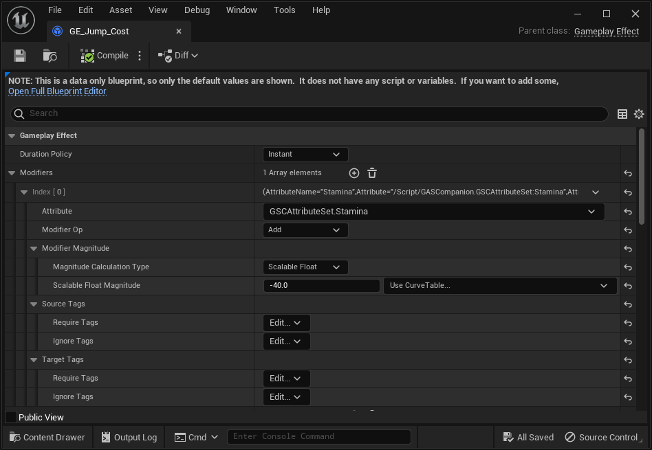

You can also decide to use other attributes, or even multiple attributes to spend on each jump.

Hit Play, each jump should now cost 40 stamina, until you have not enough resource to jump.

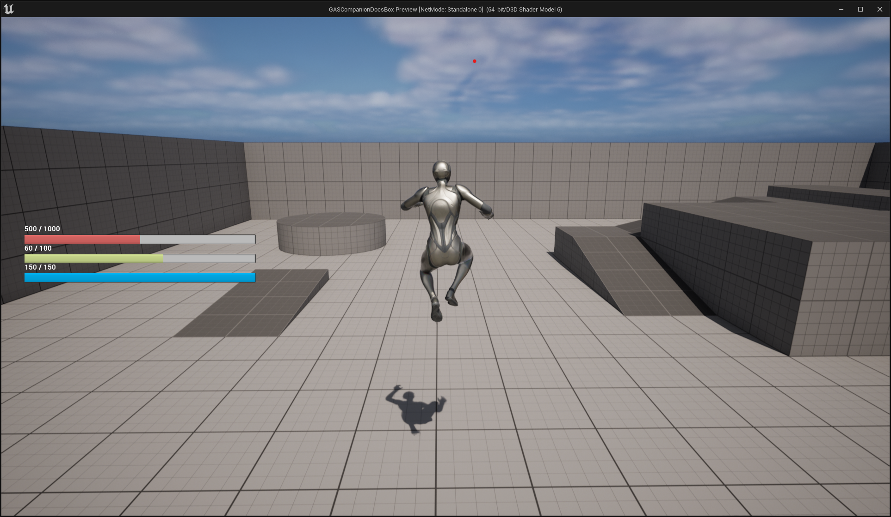

## Cooldown

You might want to associate a cooldown to an Ability. In this section, we'll go over very quickly how you can associate a Gameplay Effect to be used as the cooldown of our Jump Ability.

Abilities have a special `GameplayEffect` property specifically designed to be used as a cooldown.

We need to create a new `GameplayEffect` and make our ability use it as a `Cooldown GE` (you can click the "+" icon next to the property to quickly create one)

This Cooldown GE should be a `Duration` effect with no `Modifiers` and a unique `GameplayTag` per `GameplayAbility`, in the `GrantedTags` slot.

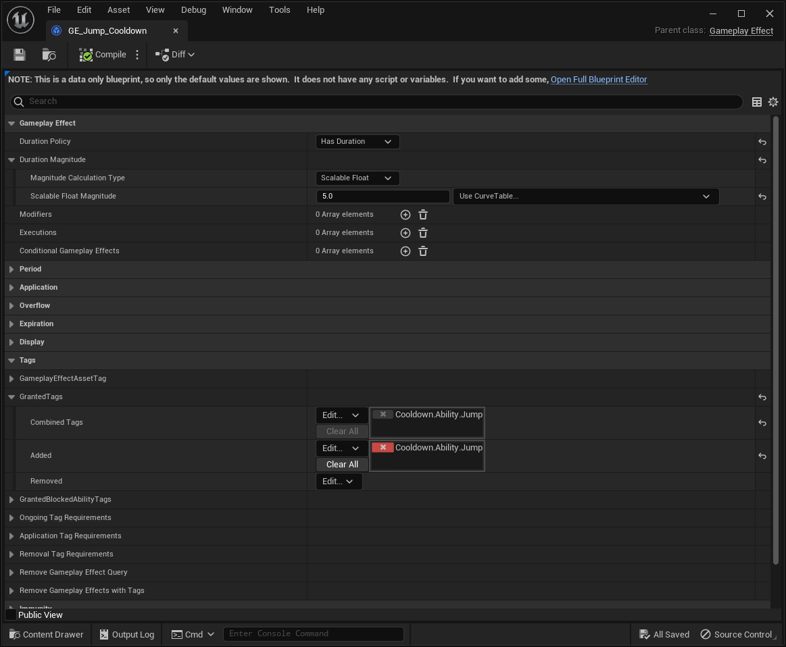

How long the cooldown will last is specified by the `Duration Magnitude`, here using a Scalable Float of 5.0 (meaning we'll be able to jump every 5 seconds).

To add new Tag for the `GrantedTags` slot, click the "Edit..." button for the "Added" row and create it from there:

Finally, make sure your ability is using this `Cooldown GE` in the `Cooldown Gameplay Effect Class` property.

For more information about Cooldown Gameplay Effect, please refer to [GASDocumentation section on this](https://github.com/tranek/GASDocumentation#4515-cooldown-gameplay-effect) as it explains the concept much better than I can do.

## Stamina Regen Gameplay Effect

Now that we have a jump ability and an associated Stamina cost, how about setting up a "passive" effect to regenerate the stamina ?

Create a new GameplayEffect, named `GE_StaminaRegen` with the following values:

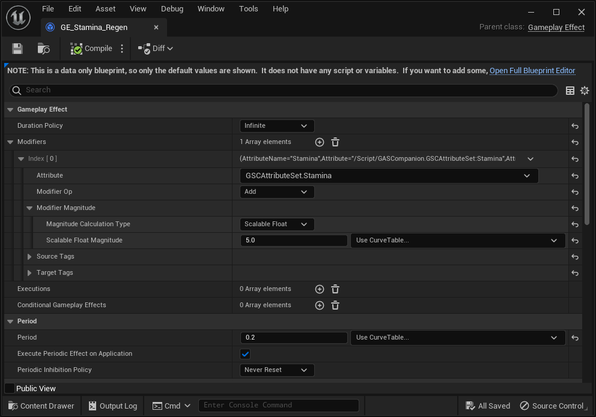

- **Duraction Policy** Infinite
- **Modifier Attribute** Stamina
- **Modifier Operation** Add
- **Modifier Magnitude** 5
- **Period** 0.2 (in seconds)

***Note:*** *You can also choose to use another attribute to calculate the amount of resource to add per period with the use of `Attribute Based` Magnitude Calculation Type, which is pretty common. `GSCAttributeSet` has a RegenRate attribute for Health, Stamina and Mana that you can use.*

We now need to apply this effect to our Character. The `Granted Effects` can be used to do that. Update the property in the Character BP for the Ability System Component:

If you Hit Play now, you should see the stamina regenerate after each Jump ;)
