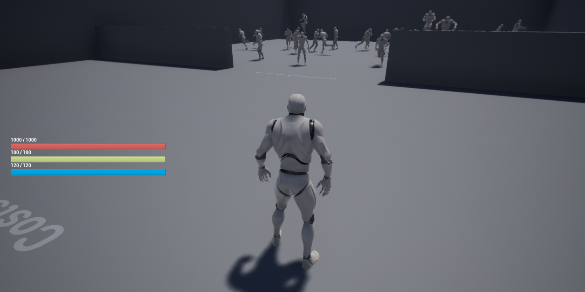
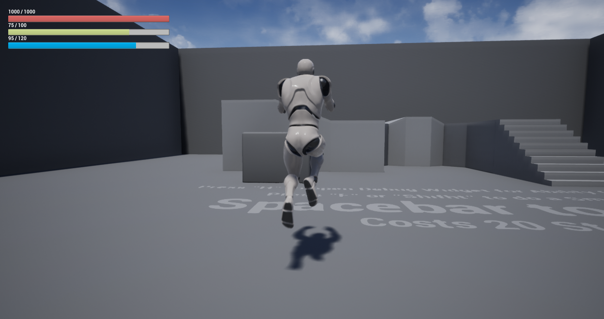
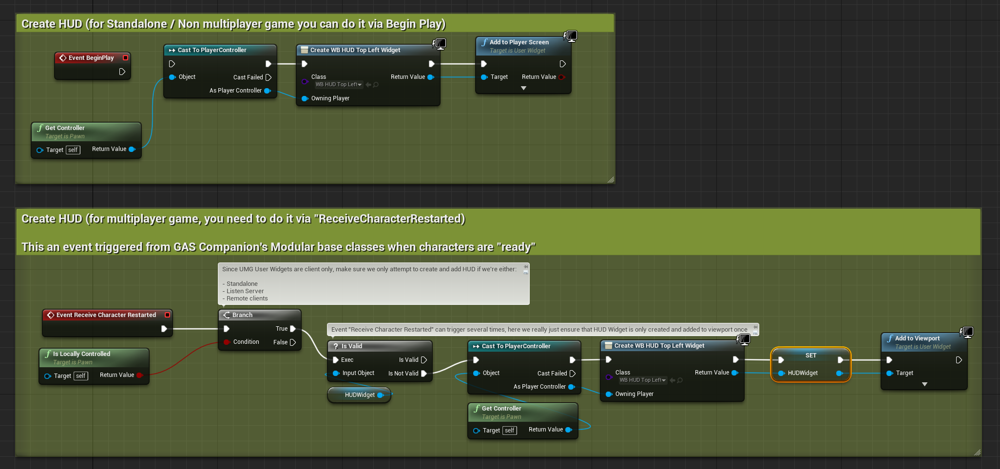
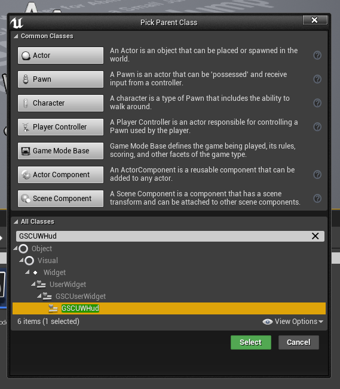
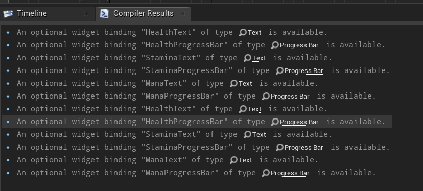
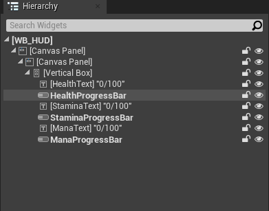
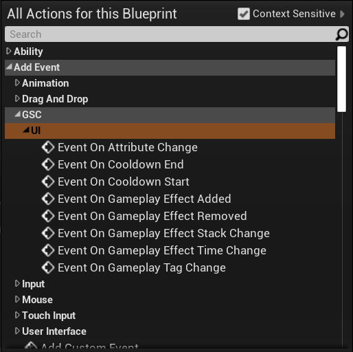
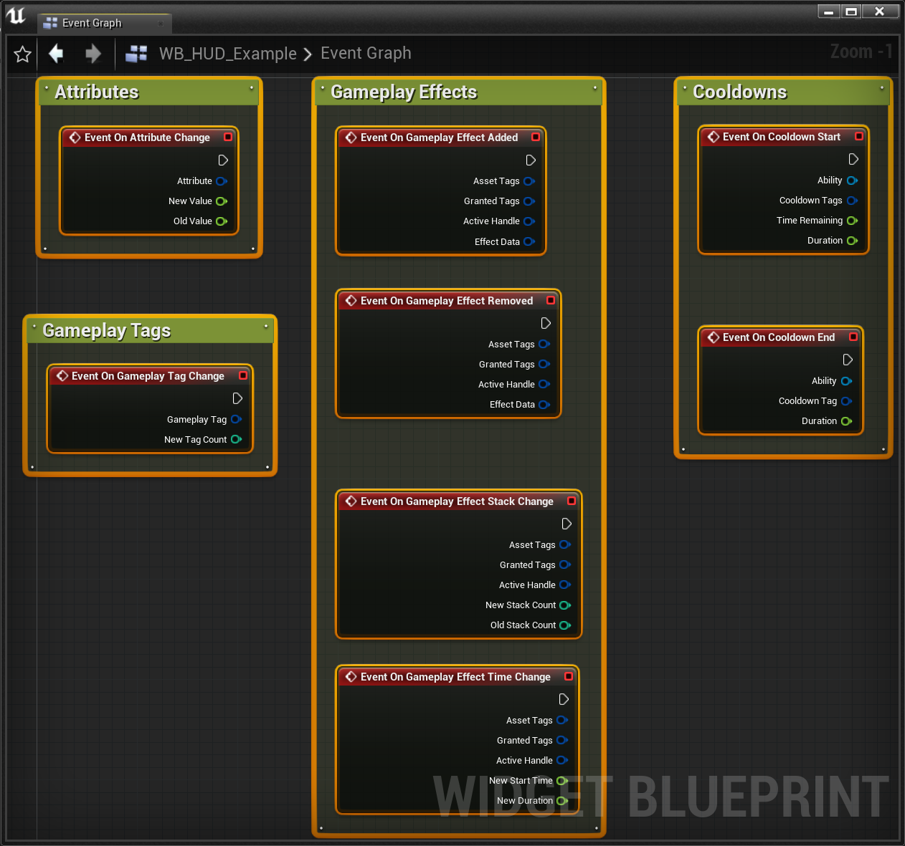

The plugin comes with a basic HUD UI and User Widgets classes set up to work with Character Attributes and other GAS related events.

They are driven by C++ [AttributeChangeDelegate](https://github.com/tranek/GASDocumentation#434-responding-to-attribute-changes) to update the HUD and respond to changes in Player Attribute values.

## GSCUWHud

GAS Companion provides three basic HUD Widget Blueprint for demonstration purpose:

- `WB_HUD` Default Widget as seen in the above picture
- `WH_HUD_TopLeft` Same Widget but with a slight variation in the positioning of the attributes progress bar
- `WB_HUD_Minimalist` Another HUD variation, this time with a minimalist feel

They all inherit from {{ "GSCUserWidget" | api }} and {{ "GSCUWHud" | api }}, a class providing a set of Blueprint exposed events related to Ability System (Attribute Changes, Cooldowns, Gameplay Effects or Tags added / removed, etc.). It also binds three progress bars (`{Health, Stamina, Mana}ProgressBar`) and Text (`{Health, Stamina, Mana}Text`) widgets, these are optional but if the User Widget (UMG) Blueprint is defining in the Widget Tree progress bars or text widget with the same name, those widgets will be bound to related attribute changes in `GSCAttributeSet`, without having to implement the Blueprint logic in the UMG event graph for those attributes.

### WB_HUD

### WB_HUD_TopLeft

### WB_HUD_Minimalist

*Icons licensed under CC BY 3.0 ([game-icons.net](https://game-icons.net/) - authors: Skoll, [sbed](https://opengameart.org/content/95-game-icons) and [Delapouite](https://delapouite.com/))*

## Adding to Viewport

Creating the widget and adding to viewport can be done from the Pawn Blueprint, on `BeginPlay` for standalone single player game, or `ReceiveCharacterRestarted` (or Pawn Restarted for Pawns) for remote clients.

## Designing your own Widget

Regarding UI, GAS Companion tries to follow the [Logic in C++, Visuals in Blueprints](https://benui.ca/unreal/ui-best-practices/#logic-in-c-visuals-in-blueprints) recommendation.

That's why the three Widget Blueprints we saw earlier all inherit from `UGSCUWHud` which is responsible for all the logic, and uses several `meta=(BindWidget)` UPROPERTY to communicate with Blueprints.

If you create a Widget Blueprint with `UGSCUWHud` as a parent class (*Right Click in Content Browser > Blueprint Class > GSCUWHud*)

And open the widget, you'll see a bunch of warnings

Those are all the `meta=(BindWidgetOptional)` UPROPERTY `UGSCUWHud` is using to update the UI. You just need to create the appropriate Widget with the exact same name in your UserWidget hierarchy.

Once defined, all the warnings will disappear and your newly created HUD should be fully functional (assuming your using GAS Companion default attributes)

### Exposed Events

Introduced in 2.1.0, `GSCUWHud` is now able to respond to a lot more events related to the Gameplay Ability System.

### Demo Project: CustomHUD

https://github.com/GASCompanion/GASCompanionDemo

New addition to the demo project is the "CustomHUD" map, which demonstrates advanced use case for HUD Widgets. The implementation is basic and one of many possible ways of doing it, but they're all using the exposed events we mentioned previously.

You'll see examples of custom attributes handling with the XP bar, listening for Gameplay Effect changes, added / removed / time change (or refresh) with the burning effect, and cooldown UI display with three basic abilities.

https://youtu.be/f0BoSDBhGi8

